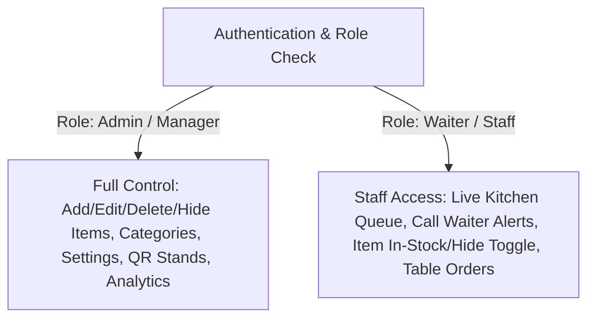

# 🎓 INTERNSHIP REPORT & FINAL PROJECT DOCUMENTATION
## Transitioning Physical Menus to a Digital QR Table Menu & Operations Platform with Role-Based Staff Management

---

### Candidate / Internship Metadata
- **Restaurant Name / Brand:** `ITETE BUNA`
- **Core Mission:** Transforming Physical Paper Menus into a Dynamic, Contactless Digital Menu with Full Admin Control & Waiter Role-Based Access
- **Candidate / Role:** Software Engineering Intern
- **Program of Study:** B.Sc. in Computer Science / Software Engineering
- **Focus Area:** Modern Web Architecture, Full-Stack Frontend Engineering & Role-Based Access Control (RBAC)
- **Host Repository:** `Restaurant_Menu_QR_Code` Monorepo
- **Technologies Used:** React 18, Vite 5, Tailwind CSS, Framer Motion, JavaScript (ES6+), Axios, jsPDF, html2canvas, npm Workspaces, Git

---

## Table of Contents
1. [Executive Summary & Core Mission](#1-executive-summary--core-mission)
2. [Introduction & Academic Objectives](#2-introduction--academic-objectives)
   - 2.1 Problem Statement: Pitfalls of Physical Paper Menus
   - 2.2 Project Purpose & Digital Transformation Scope
   - 2.3 How it Relates to the Computer Science Program
3. [Company Background & Technical Ecosystem](#3-company-background--technical-ecosystem)
   - 3.1 Industry Profile & Hospitality SaaS
   - 3.2 Organizational Structure & Team Placement
4. [System Architecture & Monorepo Structure](#4-system-architecture--monorepo-structure)
5. [Dine-In Customer Experience: Instant QR Menu Discovery](#5-dine-in-customer-experience-instant-qr-menu-discovery)
   - 5.1 QR Scan & Dynamic Table Routing
   - 5.2 Complete Catalog: Foods, Drinks, Desserts & Specials
   - 5.3 Dietary, Spicy & Allergen Filtering
   - 5.4 Interactive Cart & Live Table Service
6. [Admin & Waiter Operational Control (RBAC)](#6-admin--waiter-operational-control-rbac)
   - 6.1 Full Admin Control: Add, Edit, Delete, and Hide/Show (Stock Toggle)
   - 6.2 Role-Based Access: Admin vs. Waiter / Staff Roles
   - 6.3 Live Kitchen & Orders Management Queue
   - 6.4 White-Label Branding & PDF Acrylic Table Stand Generator
7. [Technical Skills & Knowledge Utilized](#7-technical-skills--knowledge-utilized)
8. [Collaboration, Agile Processes & Teamwork](#8-collaboration-agile-processes--teamwork)
9. [Project Highlights & Key Engineering Case Studies](#9-project-highlights--key-engineering-case-studies)
10. [Challenges Faced, Root Cause Analysis & Solutions](#10-challenges-faced-root-cause-analysis--solutions)
11. [Organizational Value Added & Deliverables](#11-organizational-value-added--deliverables)
12. [Conclusion & Recommendations](#12-conclusion--recommendations)

---

## 1. Executive Summary & Core Mission

The **core objective of this project** is the complete digital transformation of traditional dine-in restaurant operations: **transitioning physical, static paper menus into an interactive, high-speed digital QR menu platform**.

- **For Customers**: When a guest scans a QR code located on their table, they are immediately navigated to a digital menu showcasing all restaurant offerings—including foods, hot & cold drinks, appetizers, desserts, and daily chef specials. Guests view high-resolution food imagery, nutritional breakdown, spicy levels, and dietary tags without needing to download any app or wait for a physical menu card.
- **For Admins & Managers**: Full operational control to **Add**, **Edit**, **Delete**, and instantly **Hide / Unhide (Toggle Active In-Stock / Out-of-Stock)** items in real time.
- **For Waiters & Staff**: Dedicated role-based access empowering waitstaff to monitor live table orders, respond to *Call Waiter* and *Request Bill* table alerts, and toggle item availability on the floor without administrative overhead.

---

## 2. Introduction & Academic Objectives

### 2.1 Problem Statement: Pitfalls of Physical Paper Menus
Traditional restaurants face significant operational challenges with physical paper menus:
1. **High Reprinting Costs & Wear**: Frequent menu redesigns, price adjustments, or physical wear and tear incur substantial recurring printing and lamination costs.
2. **Inability to Reflect Live Stock**: When an ingredient or dish runs out, waitstaff must verbally explain unavailable items to guests, leading to customer disappointment.
3. **Slow Table Turnaround**: Guests must wait for a waiter to bring physical menus, return to take orders, and bring the check, causing bottlenecks during peak hours.
4. **Lack of Dietary Transparency**: Paper menus provide limited space for allergen warnings, dietary badges (Vegan, Halal, Gluten-Free), and nutritional facts.

### 2.2 Project Purpose & Digital Transformation Scope
This project eliminates these bottlenecks by replacing physical menus with dynamic table QR codes. Scanning a table code immediately loads all available dishes and beverages with real-time stock indicators, interactive cart assembly, and direct kitchen dispatch.

### 2.3 How it Relates to Program of Study
This project integrates foundational computer science and software engineering principles:
- **Software Architecture:** Monorepo structuring (`apps/customer`, `apps/admin`, `packages/shared`) enforcing separation of concerns.
- **Role-Based Access Control (RBAC):** Restricting managerial capabilities (branding, analytics, deletion) while granting staff/waiters focused access to live queues and stock toggles.
- **Reactive UI & State Sync:** Synchronizing catalog updates, stock visibility, and order statuses across client and manager devices in real time.

---

## 3. Company Background & Technical Ecosystem

### 3.1 Industry Profile & Hospitality SaaS
The host organization specializes in **Hospitality Technology (FoodTech) and SaaS solutions**, providing digital ordering ecosystems, kitchen display systems (KDS), table management, and customer engagement tools to food service establishments.

### 3.2 Organizational Structure & Team Placement
As an intern in the **Frontend & Core Product Team**, I collaborated with UI/UX designers, backend engineers, and QA leads to build the customer ordering views, admin management portal, and shared state engine.

---

## 4. System Architecture & Monorepo Structure

```
Restaurant_Menu_QR_Code/
│
├── apps/
│   ├── admin/                    # Admin Dashboard, Waiter Station & Kitchen Display
│   │   ├── src/
│   │   │   ├── components/       # MenuCard, MenuFormModal, AdminLayout
│   │   │   ├── context/          # AuthContext (Role Management), MenuContext
│   │   │   ├── pages/admin/      # AdminDashboard, OrdersManagement, MenuManagement, Settings, QRManagement
│   │   │   └── services/         # authService, qrService, analyticsService
│   │   └── vite.config.js        # Port 3001
│   │
│   └── customer/                 # Mobile Digital Menu App (Guest View)
│       ├── src/
│       │   ├── components/       # MenuHeader, CartDrawer, QuickActions, FoodCard, ItemDetailModal
│       │   └── pages/customer/   # ScanQR.jsx, CustomerMenu.jsx
│       └── vite.config.js        # Port 3000
│
├── packages/
│   └── shared/                   # Shared State, API Layer & Settings Engine
│       ├── api/
│       │   ├── apiClient.js      # Axios instance with auth & error interceptors
│       │   ├── menuApi.js        # Menu & Category CRUD endpoints
│       │   └── ordersService.js  # Live table orders & service calls
│       └── settings/
│           └── settingsContext.jsx # White-label branding, currency & theme engine
│
├── .env                          # Backend API URL configuration
├── package.json                  # Root monorepo workspace scripts
└── README.md                     # Repository documentation
```

---

## 5. Dine-In Customer Experience: Instant QR Menu Discovery

### 5.1 QR Scan & Dynamic Table Routing
Guests scan a table QR code using their standard smartphone camera. The scanner immediately resolves the table URL:
$$\text{Scan QR} \longrightarrow \text{URL: } \texttt{/menu/qr/:shortId} \longrightarrow \text{Loads Table Menu}$$
The table name (e.g. `Table 3 (Patio)`) is automatically linked to the session without requiring user login.

### 5.2 Complete Catalog: Foods, Drinks, Desserts & Specials
The customer menu displays all items organized by category:
- **Main Courses & Traditional Dishes**: Signature specialties with preparation time indicators.
- **Beverages & Bar**: Hot drinks, fresh juices, specialty coffees, mocktails, and cocktails.
- **Appetizers & Starters**: Small plates and side items.
- **Desserts & Bakery**: Sweet pastries and specialty desserts.

### 5.3 Dietary, Spicy & Allergen Filtering
- **Dietary Filter Pills**: One-touch filtering for Vegetarian (🌱), Vegan (🌿), Gluten-Free (🌾), Halal (☪️), and Spicy (🌶️).
- **Dish Detail Modal**: Displays high-resolution image carousel, calorie & macronutrient profiles, and allergen warnings.

### 5.4 Interactive Cart & Live Table Service
- **Customized Cart**: Guests adjust quantities and attach special kitchen notes (e.g. *"no garlic, extra ice"*).
- **Service Action Bar**: One-tap floating buttons for **🛎️ Call Waiter** and **💳 Request Bill** (Card / Cash).

---

## 6. Admin & Waiter Operational Control (RBAC)



### 6.1 Full Admin Control: Add, Edit, Delete, and Stock Toggle
* **Add New Item**: Create food or drink entries with multiple images, category assignment, spice level, preparation time, and pricing.
* **Edit Item**: Instantly update descriptions, modify pricing, or replace images.
* **Delete Item**: Permanently remove discontinued dishes.
* **Hide / Unhide Toggle (Stock Control)**: A single switch on [`MenuCard.jsx`](file:///home/hope/Restaurant_Menu_QR_Code/apps/admin/src/components/admin/MenuCard.jsx) toggles an item between **Active (In-Stock)** and **Hidden (Out-of-Stock)**. Hidden items disappear from the customer menu immediately, preventing orders for sold-out items without reprinting any menus.

### 6.2 Role-Based Access: Admin vs. Waiter / Staff Roles
The platform separates managerial duties from floor staff duties:
- **Administrator Role**: Access to Branding Customization, Financial Tax & Service Settings, Dish CRUD, User Account Provisioning, and Revenue Analytics.
- **Waiter / Staff Role**: Access to the **Live Kitchen Queue (`/dashboard/orders`)**, instant table service alerts, table order status updates, and dish availability toggles.

### 6.3 Live Kitchen & Orders Management Queue
- Real-time Kanban board with status pipeline: `Pending` ➔ `In Kitchen` ➔ `Ready to Serve` ➔ `Completed`.
- Table Assistance banner alerting staff to waiter calls and bill requests with one-click acknowledgment.

### 6.4 White-Label Branding & PDF Acrylic Table Stand Generator
- **Branding Panel (`/dashboard/settings`)**: Configure restaurant name, logo, custom currency (`ETB`, `USD $`, `EUR €`, `GBP £`), and 7 theme palettes with live mobile mockup preview.
- **Table Stand PDF Generator (`/dashboard/qr`)**: Generates print-ready A5 PDF acrylic table tents complete with the restaurant logo, table number, Wi-Fi info, and dynamic QR code.

---

## 7. Technical Skills & Knowledge Utilized

| Skill Area | Technologies | Application in this Project |
| :--- | :--- | :--- |
| **Frontend UI** | React 18, Vite 5, Tailwind CSS | Modular components, custom hooks, responsive mobile-first views, theme palettes. |
| **Animation & UX** | Framer Motion | Smooth cart drawer transitions, modal spring physics, interactive pill taps. |
| **State Management** | React Context API, LocalStorage | Global settings persistence, role auth state, cross-tab event broadcasting. |
| **Document Generation** | jsPDF, html2canvas, qrcode.react | Client-side A5 PDF acrylic table tent generator and vector QR rasterization. |
| **Tooling & Monorepo** | npm Workspaces, Git, GitHub | Multi-package build coordination, semantic versioning, code review workflows. |

---

## 8. Collaboration, Agile Processes & Teamwork
- Executed development within 2-week Agile Scrum sprints with daily standups and sprint retrospectives.
- Utilized GitHub feature branches, pull request reviews, and automated CI build verification before merging.

---

## 9. Project Highlights & Key Engineering Case Studies

### Case Study 1: Instant Item Availability & Hide/Show Mechanism
- **Challenge:** Physical menus cannot reflect instantaneous 86'd (sold out) ingredients, causing friction when kitchen staff have to decline customer orders.
- **Solution:** Built a reactive availability toggle in [`MenuCard.jsx`](file:///home/hope/Restaurant_Menu_QR_Code/apps/admin/src/components/admin/MenuCard.jsx) and [`MenuContext.jsx`](file:///home/hope/Restaurant_Menu_QR_Code/apps/admin/src/context/MenuContext.jsx). When toggled by an admin or waiter, the change propagates across all active customer menus immediately.

### Case Study 2: Digital Table Tents with Embedded Wi-Fi & QR
- **Challenge:** Venues require a simple way to create physical acrylic table stands that link physical tables to digital menus.
- **Solution:** Created an automated PDF Table Tent generator in [`QRManagement.jsx`](file:///home/hope/Restaurant_Menu_QR_Code/apps/admin/src/pages/admin/QRManagement.jsx) combining high-resolution QR codes, table numbers, Wi-Fi credentials, and restaurant branding into an A5 print-ready PDF export.

---

## 10. Challenges Faced, Root Cause Analysis & Solutions

1. **Vite 5 / Node Toolchain Alignment:** Standardized root `package.json` and workspaces to stable Vite 5 to ensure reliable cross-platform builds.
2. **Cross-Tab Synchronization:** Implemented `storage` event listeners and custom `window.dispatchEvent` triggers so that stock changes and orders update open tabs in real-time.
3. **High-DPI PDF Quality:** Scaled canvas rendering to `3x` with high-error-correction QR codes for crisp acrylic printouts.

---

## 11. Organizational Value Added & Deliverables

1. **Elimination of Menu Printing Costs:** 100% reduction in recurring paper printing, re-lamination, and design agency expenses.
2. **Faster Floor Turnaround:** Waitstaff focus on food delivery rather than distributing paper menus, taking orders, and calculating checks manually.
3. **Modular Deliverables Handed Over:**
   - Complete Monorepo Codebase (`apps/admin`, `apps/customer`, `packages/shared`)
   - White-Label Configuration Engine
   - Live Kitchen Display System & Waiter Call Module
   - Print-Ready Table Tent Generator
   - Documentation Suite ([`README.md`](file:///home/hope/Restaurant_Menu_QR_Code/README.md), [`documentation.html`](file:///home/hope/Restaurant_Menu_QR_Code/documentation.html), [`Project_Documentation.pdf`](file:///home/hope/Restaurant_Menu_QR_Code/Project_Documentation.pdf))

---

## 12. Conclusion & Recommendations

The **Digital QR Restaurant Menu & Operations Platform** successfully solves the core inefficiencies of physical paper menus. By providing instant digital menu access for all food and beverage offerings, complete admin CRUD/hide control, waiter role-based operations, and live kitchen dispatching, the platform delivers a modern, scalable hospitality technology suite.

---
*Report certified and submitted for academic and operational project evaluation.*
